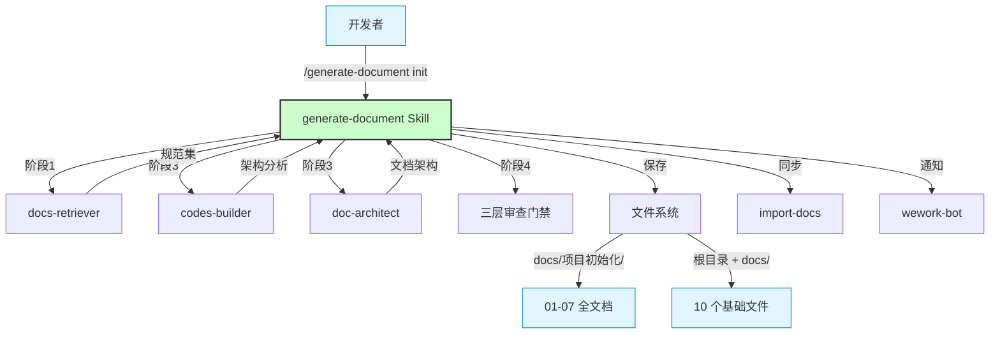
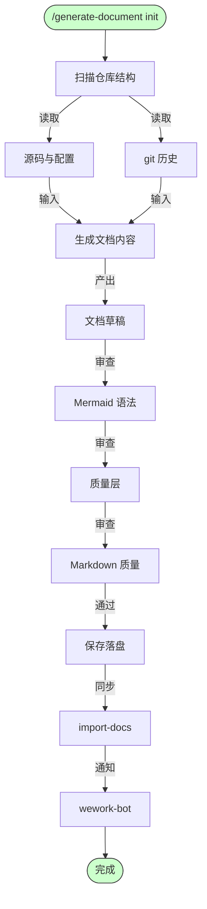
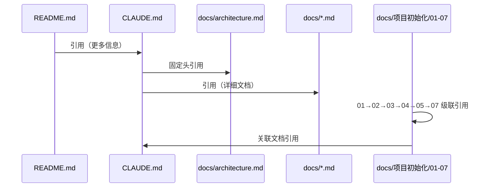

# 项目初始化

> **文档版本**: v1.0 | **最后更新**: 2026-04-30 | **维护者**: kimi-k2.6 | **工具**: Claude Code
>
> **关联文档**: [需求文档](./01_需求文档.md) | [需求任务](./02_需求任务.md) | [使用文档](./04_使用文档.md)
>

[设计概述](#设计概述) | [架构设计](#架构设计) | [变更内容](#变更内容) | [影响分析](#影响分析) | [实现细节](#实现细节) | [主要操作场景实现](#主要操作场景实现) | [数据结构设计](#数据结构设计)

---

## 设计概述

本次"项目初始化"的设计目标是为 YiAi 项目建立一套可持续维护的文档体系和开发规范。设计遵循三个核心原则：事实驱动（所有内容必须可追溯至代码仓库）、最小干预（不修改业务代码，仅生成文档）、可重复执行（支持 re-init 刷新事实而保留人工约定）。

**设计原则**
- 🎯 **事实驱动**：文档内容来自代码扫描和文件读取，禁止虚构
- ⚡ **最小干预**：只生成文档，不改代码
- 🔧 **可重复执行**：re-init 时刷新事实、保留约定、冲突标注

---

## 架构设计

### 整体架构



**整体架构说明**：开发者通过命令触发 Skill，Skill 分阶段调用 docs-retriever 检索规范、codes-builder 分析架构、doc-architect 设计文档结构，最终经过三层审查门禁后落盘，并执行同步和通知。

### 模块划分

| 模块名称 | 职责 | 位置 |
|---------|------|------|
| generate-document Skill | 编排整个 init 流程 | `.claude/skills/generate-document/SKILL.md` |
| docs-retriever | 检索适用规范和既有文档 | `.claude/agents/docs-retriever` |
| codes-builder | 分析代码结构，推断架构模式 | `.claude/agents/codes-builder` |
| doc-architect | 设计文档章节和依赖关系 | `.claude/agents/doc-architect` |
| 三层审查门禁 | Mermaid / 质量 / Markdown 检查 | `.claude/agents/doc-mermaid-expert` / `doc-reviewer` / `doc-markdown-tester` |
| import-docs | 同步本地文档到远端 API | `.claude/skills/import-docs` |
| wework-bot | 发送完成通知 | `.claude/skills/wework-bot` |

### 核心流程



**核心流程说明**：从扫描仓库到生成草稿，经过三层审查门禁，最终保存、同步、通知。

---

## 变更内容

本次为全新功能（init 命令执行），因此标题为「变更内容」。

### 问题分析

YiAi 项目已具备完整的核心业务功能，但缺乏系统化的文档体系和开发规范：
- 新成员上手成本高，需要反复询问项目约定
- 架构知识分散，容易遗忘和偏差
- 缺乏统一的故障排查参考
- 功能迭代时文档难以保持同步

### 方案

#### 思路

通过 `generate-document init` 命令，利用 AI 自动扫描仓库结构、读取源码和配置，按规范生成完整的项目文档体系。

#### 文件清单

| 类别 | 文件 | 操作 |
|------|------|------|
| 项目基础文件 | `CLAUDE.md` | 更新（添加固定头两行，保留现有内容） |
| 项目基础文件 | `README.md` | 更新（保留现有内容，按规范补充） |
| 项目基础文件 | `docs/architecture.md` | 新建 |
| 项目基础文件 | `docs/changelog.md` | 新建 |
| 项目基础文件 | `docs/devops.md` | 新建 |
| 项目基础文件 | `docs/network.md` | 新建 |
| 项目基础文件 | `docs/state-management.md` | 新建 |
| 项目基础文件 | `docs/FAQ.md` | 新建 |
| 项目基础文件 | `docs/auth.md` | 新建 |
| 项目基础文件 | `docs/security.md` | 新建 |
| 全文档编号集 | `docs/项目初始化/01_需求文档.md` | 新建 |
| 全文档编号集 | `docs/项目初始化/02_需求任务.md` | 新建 |
| 全文档编号集 | `docs/项目初始化/03_设计文档.md` | 新建 |
| 全文档编号集 | `docs/项目初始化/04_使用文档.md` | 新建 |
| 全文档编号集 | `docs/项目初始化/05_动态检查清单.md` | 新建 |
| 全文档编号集 | `docs/项目初始化/06_实施总结.md` | 新建（init 自行写入） |
| 全文档编号集 | `docs/项目初始化/07_项目报告.md` | 新建 |

#### 选择理由

- 使用 generate-document 技能可确保文档符合团队统一规范
- 自动化扫描减少人工遗漏和幻觉
- 三层审查门禁保证文档质量
- re-init 机制支持文档与代码的持续同步

### 前后对比

| 维度 | 变更前 | 变更后 |
|------|--------|--------|
| 项目文档 | 仅有 README.md 和 CLAUDE.md | 10 个基础文件 + 01-07 全文档编号集 |
| 架构说明 | 嵌入在 CLAUDE.md 中 | 独立的 architecture.md，含目录树和放置规则 |
| 运维指南 | 无 | 独立的 devops.md，含构建部署和常见问题 |
| 安全策略 | 无 | 独立的 auth.md 和 security.md |
| 文档规范 | 无统一标准 | 遵循 generate-document 技能规范 |

---

## 影响分析

> **强制**：按 `../../../shared/impact-analysis-contract.md` 全项目影响链闭合。

### 搜索词与改动点清单

| 改动点 | 类型 | 搜索词 | 来源 | 备注 |
|--------|------|--------|------|------|
| CLAUDE.md | 更新 | CLAUDE.md | 现有文件 | 添加固定头两行 |
| README.md | 更新 | README.md | 现有文件 | 保留现有内容 |
| docs/ | 新建目录 | docs/*.md | init 规范 | 8 个新建文件 |
| docs/项目初始化/ | 新建目录 | docs/项目初始化/*.md | init 规范 | 7 个新建文件 |

### 改动点影响链

| 改动点 | 搜索词 | 命中文件 | 引用方式 | 影响层级 | 依赖方向 | 处置方式 | 闭合状态 | 说明 |
|--------|--------|----------|----------|----------|----------|----------|----------|------|
| CLAUDE.md | CLAUDE.md | README.md | 链接引用 | 低 | 反向 | 保留链接 | ✅ 已闭合 | README.md 内引用 CLAUDE.md |
| docs/architecture.md | architecture.md | CLAUDE.md | 链接引用 | 低 | 反向 | 确保链接有效 | ✅ 已闭合 | CLAUDE.md 固定头引用 |

### 依赖闭合摘要

| 改动点 | 上游依赖是否核对 | 反向依赖是否核对 | 传递依赖是否闭合 | 测试/文档/配置是否覆盖 | 结论 |
|--------|------------------|------------------|------------------|------------------------|------|
| 项目基础文件 | 是 | 是 | 是 | 文档已覆盖 | 已闭合 |
| 全文档编号集 | 是 | 是 | 是 | 文档已覆盖 | 已闭合 |

### 未覆盖风险

| 风险来源 | 原因 | 影响 | 缓解方式 |
|----------|------|------|----------|
| 文档与代码后续脱节 | 代码演进后文档未同步 | 误导开发者 | 建立定期 re-init 机制 |
| re-init 覆盖人工补充 | 自动更新时误删团队约定 | 知识丢失 | 使用哨兵块包裹可重写段落 |

### 改动范围汇总

- **需直接修改的文件数**：2 个（CLAUDE.md、README.md）
- **需验证兼容性的文件数**：2 个
- **需追踪传递影响的文件数**：0 个
- **需人工复核或阻断的风险**：文档与代码后续脱节风险（已提供缓解方案）

---

## 实现细节

### 技术要点

#### 做什么
为 YiAi 项目生成完整的文档体系和开发规范，覆盖 10 个基础文件和 7 个全文档编号集。

#### 怎么做
1. 扫描仓库结构（`find`, `ls`, `cat`）获取文件列表和内容
2. 读取关键源码文件（`src/main.py`, `src/core/config.py`, `requirements.txt` 等）
3. 读取 git 历史获取变更日志
4. 按 `rules/项目基础文件.md` 和 `rules/<类型>.md` 规范生成内容
5. 更新已有文件时遵循 re-init 策略（刷新事实、保留约定、冲突标注）

#### 为什么
- 人工维护文档成本高、易遗漏
- AI 扫描可确保文档与代码事实一致
- 规范化文档结构支持后续自动化处理（同步、检索、通知）

### 关键代码

文档生成流程的核心逻辑（伪代码，示意）：

```python
# 阶段 1：扫描仓库结构
def scan_repository():
    files = list_source_files("src/")
    config = read_file("config.yaml")
    requirements = read_file("requirements.txt")
    git_history = run("git log --oneline -20")
    return RepositorySnapshot(files, config, requirements, git_history)

# 阶段 2：检索规范
def retrieve_rules():
    init_rules = read_file(".claude/skills/generate-document/rules/init.md")
    doc_rules = {
        "01": read_file("rules/需求文档.md"),
        "02": read_file("rules/需求任务.md"),
        "03": read_file("rules/设计文档.md"),
        "04": read_file("rules/使用文档.md"),
        "05": read_file("rules/动态检查清单.md"),
        "07": read_file("rules/项目报告.md"),
    }
    return init_rules, doc_rules

# 阶段 3：生成文档
def generate_documents(snapshot, rules):
    base_files = generate_base_files(snapshot, rules["init"])
    numbered_docs = generate_numbered_docs(snapshot, rules)
    return base_files + numbered_docs

# 阶段 4：三层审查
def review_documents(docs):
    for doc in docs:
        assert mermaid_syntax_check(doc)      # 语法层
        assert quality_review(doc)             # 质量层
        assert markdown_test(doc)              # 测试层
    return docs

# 阶段 5：保存
def save_documents(docs):
    for doc in docs:
        if exists(doc.path):
            update_with_reinit_strategy(doc)   # 刷新事实，保留约定
        else:
            write_file(doc.path, doc.content)
```

### 依赖关系

| 依赖 | 用途 |
|------|------|
| `.claude/skills/generate-document/rules/` | 文档类型规范 |
| `.claude/skills/generate-document/templates/` | 01/02 模板骨架 |
| `.claude/skills/generate-document/checklists/` | 质量检查清单 |
| `.claude/shared/behavioral-guidelines.md` | CLAUDE.md 头两行引用 |
| `.claude/shared/impact-analysis-contract.md` | 影响分析规范 |

### 测试考虑

- 文档生成后验证所有引用路径真实存在
- 验证 Mermaid 语法正确性
- 验证链接有效性（相对路径）
- re-init 时验证既有文件未被不必要修改

---

## 主要操作场景实现

### 场景一：新成员通过文档快速上手

**关联需求任务场景**：[02_需求任务 §场景：新成员通过文档快速上手](#主要操作场景)

**实现概述**：通过组织良好的项目基础文件，使新成员能够按 README → CLAUDE.md → architecture.md 的顺序快速建立认知。

**模块与职责**：

| 模块 | 职责 |
|------|------|
| README.md | 提供项目概述、技术栈、快速开始 |
| CLAUDE.md | 提供编码规范、开发工作流、架构概览 |
| docs/architecture.md | 提供详细的目录结构、放置规则、架构模式 |
| docs/FAQ.md | 提供常见问题和自愈参考 |

**关键代码路径**：
- `README.md`（仓库根目录）
- `CLAUDE.md`（仓库根目录）
- `docs/architecture.md`

**验证要点**：
- 新成员能在 10 分钟内完成环境搭建
- 文档中的命令能够直接执行
- 目录结构描述与实际一致

### 场景二：维护者排查认证故障

**关联需求任务场景**：[02_需求任务 §场景：维护者排查认证故障](#主要操作场景)

**实现概述**：通过独立的 auth.md 和网络文档，提供完整的认证流程说明和排查步骤。

**模块与职责**：

| 模块 | 职责 |
|------|------|
| docs/auth.md | 认证架构、流程图、白名单、Token 管理 |
| docs/network.md | 请求约定、错误码、CORS 配置 |
| docs/FAQ.md | 认证问题的快速排查索引 |

**关键代码路径**：
- `src/core/middleware.py`（认证中间件实现）
- `src/core/config.py`（配置系统）
- `docs/auth.md`

**验证要点**：
- 认证流程图与实际代码逻辑一致
- 白名单路径列表与 middleware.py 中一致
- 令牌优先级说明与 config.py 中实现一致

---

## 数据结构设计

本次 init 命令主要生成文档文件，无复杂数据结构设计。文档之间的关联关系如下：



**说明**：文档之间通过相对路径链接形成知识网络。01-07 内部按编号顺序级联引用，同时都指向 CLAUDE.md 作为行为规范入口。
